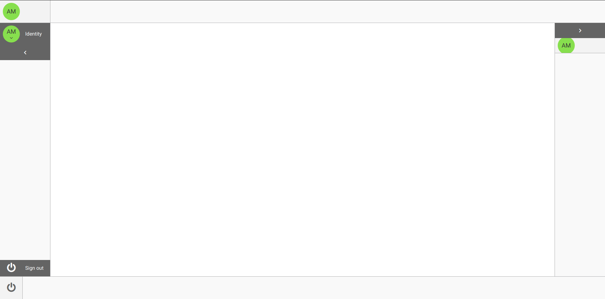

# Utilisation

## Accès

* L'accès à la page d'administration des Hub Station se fait via l'url suivante : `<contexte>`/hub/admin
    * L'administration d'une instance de Hub Station se fait via l'url suivante: `<contexte>`/hub/admin/`<docid>`

::: tip
La personne en charge de l'administration des Hub Station doit avoir le rôle de `HubAdmin`
:::

* L'accès à l'interface utilisateur du Hub Station se fait via l'url suivante : `<contexte>`/hub/station/`<docid>`

::: tip
 L'utilisateur final du Hub Station doit avoir le rôle de `HubUser`
:::

Dans le cas où vous souhaitez utiliser l'application, mais que vous ne pouvez pas y accéder, demandez à votre administrateur de vous donner le droit ou le compte ayant le droit, pour l'interface désirée.

## Application

#### Hub Admin
    Insérer une image

L'application se compose d'une grille dans laquelle se présente tous les Hub Station disponible.
Une fois l'utilisateur identifié, il peut :

* Consulter la liste des Hub Station disponible
* Via les boutons d'actions en bout de ligne :
    * Visualiser la configuration d'un Hub Station en cliquant sur `Display`
    * Configurer le Hub Station en cliquant sur `Configure`
* Filtrer les Hub Station
* Trier les Hub Station
* Via la barre d'outil, effectuer les actions :
    * Créer un Hub Station

#### Hub Station Admin

L'application se compose d'une grille dans laquelle se présente tous les objets de configuration de hub disponible.
Une fois l'utilisateur identifié, il peut :

* Consulter la liste des configurations de hub disponible
* Via les boutons d'actions en bout de ligne :
    * Ouvrir la fiche d'un élément de configuration en cliquant sur `Consulter`
    * Editer la fiche d'un élément de configuration en cliquant sur `Editer`
* Filtrer les éléments de configuration disponibles
* Trier les éléments de configuration disponibles
* Via la barre d'outil, effectuer les actions :
    * Exporter l'ensemble des configuration de hub (ou celles sélectionnées) dans un fichier structuré de type XML en cliquant sur `Exporter`
    * Importer l'ensemble des configurations de hub depuis un fichier structuré de type XML
    * Créer un type d'élément de configuration :
        * Cliquer sur le sélecteur intitulé `Créer`
        * Sélectionner l'élément de configuration de hub dans la liste déroulante

#### Hub Station

L'application se compose d'une partie `Dock` configurée par l'administrateur du Hub Station.
L'interface permet de :

* Présenter les éléments configurés par l'administrateur dans le/les `Dock`, pouvant recouvrir les quatres bordures de la fenêtre
* Consulter le contenu de l'élément sélectionné

